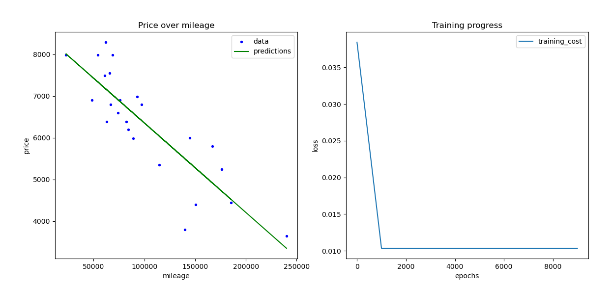

# Car Price Prediction with Linear Regression

## Overview
This project utilizes linear regression to predict car prices based on mileage data. The README covers key concepts and libraries used in the implementation.

## Key Concept
- Linear Regression
- Normalization
- Learning Rate
- Libraries (NumPy, Matplotlib)
- Gradient Descent
- Cost Function
- Metrics (Mean Squared Error, R-squared Score)

## Linear Regression
Linear regression is a statistical method used to model the relationship between a dependent variable and one or more independent variables. In this project, we use linear regression to model the relationship between car prices and mileage.

## Normalization
Normalization is the process of scaling input features to a similar range. It helps in improving the convergence speed and stability of gradient descent algorithms. In our project, we normalize the mileage data to facilitate effective learning.

## Learning Rate
The learning rate is a hyperparameter that determines the step size taken during gradient descent optimization. It influences the convergence speed and accuracy of the model. We experiment with different learning rates to find the optimal value for our linear regression model.

## Libraries
- **NumPy**: NumPy is used for numerical computations, particularly for handling arrays and matrices efficiently.
- **Matplotlib**: Matplotlib is a plotting library used for visualizing data, including scatter plots, line plots, and histograms. We use it to visualize the dataset and model performance.

## Gradient Descent
Gradient descent is an optimization algorithm used to minimize the cost function by iteratively adjusting model parameters. It's the backbone of training linear regression models. We implement gradient descent to optimize the parameters of our model.

## Cost Function
The cost function measures the difference between predicted and actual values. In linear regression, the cost function quantifies the error between predicted and true car prices. We minimize this error during training using gradient descent.

## Metrics
- **Mean Squared Error (MSE)**: MSE measures the average squared difference between predicted and actual values. It's a commonly used metric to evaluate the performance of regression models.
- **R-squared Score (R2 Score)**: R2 score represents the proportion of variance in the dependent variable that's predictable from the independent variables. It provides insight into how well the model fits the data.

## Result

## Resources

- [Machine Learning Specialization: Coursera](https://www.coursera.org/specializations/machine-learning-introduction?utm_campaign=WebsiteCourses-MLS-TopButton-mls-launch-2022&utm_medium=institutions&utm_source=deeplearning-ai)
- [Machine Learning Specialization: github](https://github.com/greyhatguy007/Machine-Learning-Specialization-Coursera)
- https://youtu.be/V_xro1bcAuA
- [Hands On Machine Learning with Scikit Learn and TensorFlow.pdf](https://github.com/yanshengjia/ml-road/blob/master/resources/Hands%20On%20Machine%20Learning%20with%20Scikit%20Learn%20and%20TensorFlow.pdf)
- [ml-road](https://github.com/yanshengjia/ml-road/tree/master)